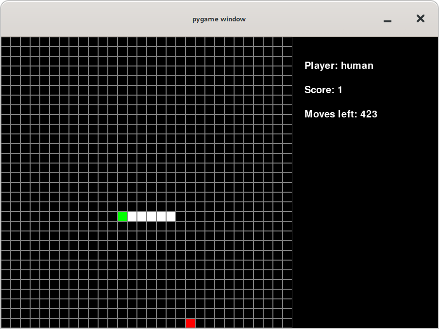

# snake
A demo of teaching simple neural network to play game of snake.

This was written as a quick extension of the car driving <https://github.com/mdziemianko/cars> project I did as a demo for my friends kid. 

 

 
Feel free to use for any non-commercial purpose.    
        
## Instructions
  - python 3.6+         
  - download the code
  - install the requirements using pip or conda (e.g. `pip install requirements.txt`)
  - run by executing either `python src/main.py [saved_snake_file]` to play the game youself or `python src/train.py` to watch the training.
  Training saves each improved snake in a file, that can be given as a parameter `saved_snake_file` to simulate a computer player.
  
  The snakes are generated by random mutation of the 'parents' - the snakes chosen 
  in previous generation as best performing in terms of achieved score.
  
## How it works
  The program operates in a very simple way. 
  
  Each snake scanes its surroundings in each of 4 main direction (up, down, left, right) and 
  gets distance to the nearest obstacle (edge of the board or the snake tail), and information whether 
  you can see an apple in this direction.
  
  The snake interprets these signals and produces 4 output signals that indicate whether the snake should
  go in one of the 4 primary directions. The provided implementation is a simple Neural Network that can be configured
  with any combination of hidden layers.  
  
  Initially the snakes are generated randomly, however in each consecutive round,
  the offsprings are created by randomly mutation a set of 'parents' that were selected
  among snakes of previous generation. This very simple technique akin to 'Genetic Programming'
  is powerful enough to create snakes capable of playing an extended game.  
  
## License
   
  Copyright (C) 2020 
    
  This program is free software: you can redistribute it and/or modify
  it under the terms of the GNU General Public License as published by
  the Free Software Foundation, either version 3 of the License, or
  (at your option) any later version.
    
  This program is distributed in the hope that it will be useful,
  but WITHOUT ANY WARRANTY; without even the implied warranty of
  MERCHANTABILITY or FITNESS FOR A PARTICULAR PURPOSE.  See the
  GNU General Public License for more details.
    
  You should have received a copy of the GNU General Public License
  along with this program.  If not, see <https://www.gnu.org/licenses/>.
     
